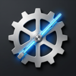
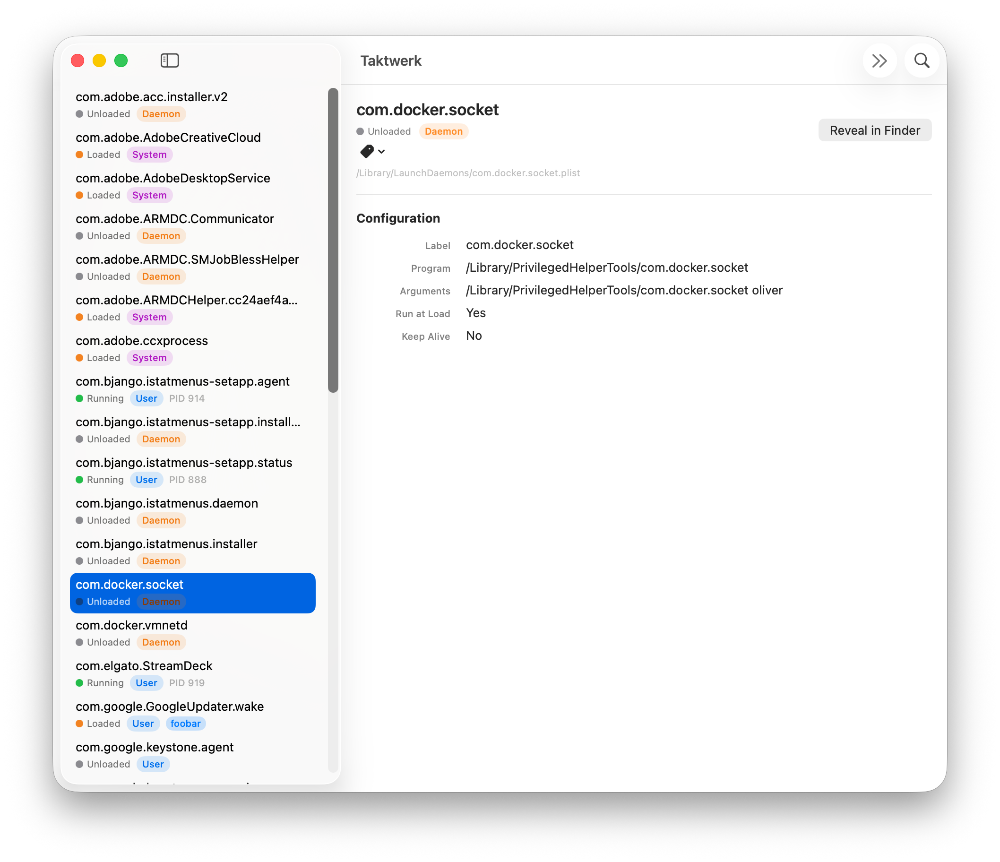

<p align="center">
  
</p>

<h1 align="center">Taktwerk</h1>

<p align="center">
  A native macOS application for managing <strong>launchd agents and daemons</strong> — built with SwiftUI.
</p>

Taktwerk provides a clean GUI for browsing, editing, loading, and unloading launchd jobs across all standard directories on macOS. It's designed for developers and power users who work with launchd configuration files regularly.

## Features

- **Browse all launchd sources** — User Agents, Global Agents, User Daemons, Global Daemons
- **Visual plist editor** — Edit job properties (label, program, schedule, environment, etc.) through a structured form
- **Raw XML editor** — Switch to raw XML with live validation and Apple's `plutil` lint integration
- **Two-way sync** — Changes in the form reflect in XML and vice versa
- **Load / Unload** — Control launchd jobs directly from the UI
- **Custom tags** — Organize jobs with colored tags; filter by tag or source
- **Filter status bar** — Always see which filters are active
- **Settings** — Configure default view filters, manage tag definitions with rename support
- **Refresh** — Re-scan launchd directories to pick up external changes

## Screenshot

<p align="center">
  
</p>

## Requirements

- macOS 26 (Tahoe) or later
- Xcode 26+
- Swift 6.2+

## Getting Started

```bash
# Install XcodeGen (if not already installed)
brew install xcodegen

# Generate the Xcode project
xcodegen generate

# Open in Xcode
open Taktwerk.xcodeproj
```

Build and run from Xcode (⌘R).

> **Note:** Taktwerk requires access to launchd directories and the `launchctl` binary. It runs without App Sandbox and uses Hardened Runtime.

## Project Structure

```
Taktwerk/
├── Models/       # Domain models (LaunchdJob, PlistConfig, TagStore, etc.)
├── Services/     # Actor-based services (LaunchctlService, PlistService, LogService)
├── Features/     # Feature modules (JobList, JobDetail, JobEditor, Settings)
├── Shared/       # Reusable views and extensions
└── Resources/    # Bundled resources
TaktwerkTests/    # Unit tests (Swift Testing)
project.yml       # XcodeGen project specification
```

## Architecture

- **MVVM** with `@Observable` ViewModels
- **Actor-based services** for thread-safe system interaction
- **Zero third-party dependencies** — pure Foundation + SwiftUI
- **Swift Testing** for unit tests

## Running Tests

```bash
xcodebuild -project Taktwerk.xcodeproj -scheme Taktwerk -configuration Debug test
```

## Versioning & Releases

Taktwerk uses [semantic versioning](https://semver.org/) driven by Git tags.

**Creating a release:**

```bash
git tag v1.2.0
git push origin v1.2.0
```

This triggers the release workflow which builds a signed, notarized DMG and publishes it as a GitHub Release.

**Version numbers:**
- `CFBundleShortVersionString` = tag version (e.g., `1.2.0`)
- `CFBundleVersion` = CI build number (auto-incremented)

### CI/CD

| Workflow | Trigger | What it does |
|----------|---------|--------------|
| **CI** | Push to `main`, PRs | Build + test |
| **Release** | `v*` tags | Build → sign → DMG → notarize → GitHub Release |

Both workflows run on a **self-hosted macOS runner** (macOS 26 + Xcode 26 required).

### Self-Hosted Runner Setup

The CI/CD pipeline requires a self-hosted GitHub Actions runner on a macOS 26 (Tahoe) machine with Apple Silicon.

**Prerequisites on the runner machine:**

```bash
# Install Xcode 26 from the Mac App Store or Apple Developer portal
# Then accept the license:
sudo xcodebuild -license accept

# Install XcodeGen
brew install xcodegen

# Verify
xcode-select -p   # Should point to Xcode 26
xcodegen --version
```

**Register the runner:**

1. Go to your GitHub repo → **Settings** → **Actions** → **Runners** → **New self-hosted runner**
2. Select **macOS** and **ARM64**
3. Follow the download and configuration steps shown on the page:

```bash
# Download (URL from GitHub UI)
mkdir actions-runner && cd actions-runner
curl -o actions-runner.tar.gz -L <download-url>
tar xzf actions-runner.tar.gz

# Configure
./config.sh --url https://github.com/<owner>/Taktwerk --token <token>
# When prompted for labels, add: self-hosted,macOS,ARM64

# Install as a service (runs on boot)
sudo ./svc.sh install
sudo ./svc.sh start
```

**Required GitHub Secrets** (repo → Settings → Secrets and variables → Actions):

| Secret | Description |
|--------|-------------|
| `APPLE_CERTIFICATE_P12` | Base64-encoded Developer ID Application `.p12` certificate |
| `APPLE_CERTIFICATE_PASSWORD` | Password for the `.p12` file |
| `APPLE_TEAM_ID` | Apple Developer Team ID (10-char alphanumeric) |
| `APPLE_ID` | Apple ID email for notarization |
| `APPLE_ID_PASSWORD` | [App-specific password](https://support.apple.com/en-us/102654) for the Apple ID |
| `KEYCHAIN_PASSWORD` | Any random string (used for a temporary build keychain) |

**Exporting your Developer ID certificate:**

```bash
# In Keychain Access: find "Developer ID Application: <Your Name>"
# Right-click → Export → save as .p12 with a password
# Then base64-encode it:
base64 -i certificate.p12 | pbcopy
# Paste into the APPLE_CERTIFICATE_P12 secret
```

## License

[MIT](LICENSE)

## Author

Oliver Lohmann
